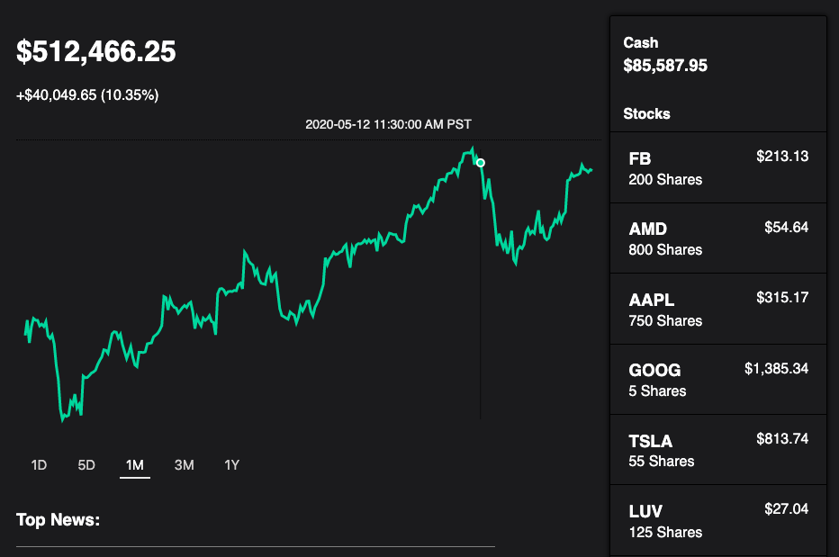
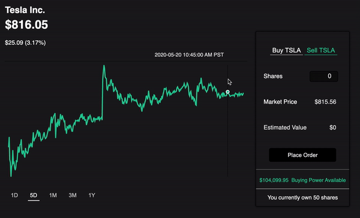

## Welcome to iTrade!

[Click Here - Live Site](http://i-trade-app.herokuapp.com)

### Background

 iTrade is a tribute to the popular stock trading app Robinhood. Users may use pseudo money to buy and sell equity shares in thousands of publicly traded companies. Interactive graphs provide historical pricing data on individual stocks. The main dashboard provides users with an interactive graph of their overall performance. The site also provides live pricing, news, and other informative data about their investments.

### Features

* Recharts library displays live & historical stock prices using API data
* Filtered data from News API displays relevant news on selected companies
* Connection to rails backend allows users to simulate stock trades
* Stock search feature allows users to find publicly traded companies

### Dashboard Page

* Overview of stock holdings (# of shares, current price)
* Historical stock graph displaying combined value of current holdings 
* General news section providing recent business-related articles 

### Stock Page

* Company data such as market cap, industry, etc. 
* Historical stock graphs implemented using Recharts & API Data
* Rule-based transactions to modify holdings in the Rails backend
* Company news section filtering recent news for relevant articles 

### Company Search

### Technologies & Libraries

* Frontend: Javascript | React.js | Redux.js
* Backend: Ruby on Rails | ActiveRecord | PostgreSQL
* [Twelvedata API](http://twelvedata.com)
* [News API](http://newsapi.org)
* [Financial Modeling Prep API](https://financialmodelingprep.com)
* [Recharts](http://recharts.org)

