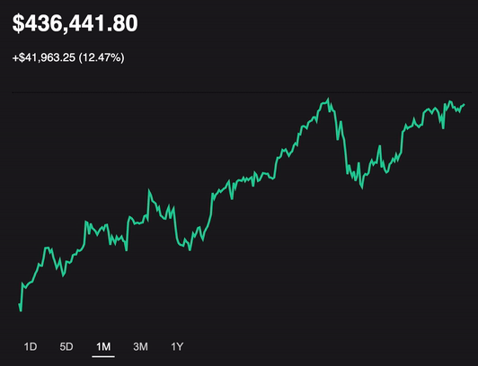

## Welcome to iTrade!

### API limits have been downgraded. Limited functionality

[Click Here - Live Site](http://i-trade-app.herokuapp.com)

### Background

 iTrade is a tribute to the popular stock trading app Robinhood. You can use pseudo money to buy and sell equity shares in thousands of publicly traded companies. Interactive graphs provide historical pricing data on individual stocks. The main dashboard provides users with an interactive graph of their overall performance. The site also provides live pricing, news, and other informative data about their investments.


### Features

* Pages display live & historical stock prices using API data and the Recharts charting library, enabling users to keep track of their investment performance.
* Filtered data from a News API displays relevant news for selected companies and the overall market, helping provide users with context to potentially explain recent price movements.
* The connection to the Rails backend allows users to simulate stock trades that persist over time.
* The stock search feature allows users to find publicly traded companies in an efficient manner.


### Dashboard Page

* Overview of stock holdings (# of shares, current price)
* Historical stock graph displaying combined value of current holdings 
* General news section providing recent business-related articles 



### Stock Page

* Company data such as market cap, industry, etc. 
  * Achieved with custom API calls to [Financial Modeling Prep](https://financialmodelingprep.com)
* Company news section providing relevant news 
  * Achieved with custom API calls to [News API](http://newsapi.org)
* Historical stock graphs populated with price data from custom API calls to [Twelvedata API](http://twelvedata.com)
  ```js
  updatePrices(key) {
        if (this.state.period !== key) {
            return e => {
                switch (key) {
                    case '1D':  
                        fetchDailyPrices(this.props.ticker).then(response => this.renderDay(response));
                        break;
                    case '5D':  
                        fetch5D(this.props.ticker).then(response => this.render5D(response));
                        break;
                    case '1M': 
                        fetch1M(this.props.ticker).then(response => this.render1M(response));
                        break;
                    case '3M': 
                        fetch3M(this.props.ticker).then(response => this.render3M(response));
                        break;
                    case '1Y': 
                        fetch1Y(this.props.ticker).then(response => this.render1Y(response));
                        break;
                };
            };
        };
    };
  ```
* Rule-based transactions to modify holdings in the Rails backend
  ```js
   if (holding.share_count === 0) {
              return;
          } else if ( this.state.tranType === "buy"){
              if ((this.state.share_count * Number((this.props.price).replace(/[^0-9.-]+/g, ""))) < (this.state.cash)) {
                  if (this.props.holdings.share_count > 0) {
                      let total = holding.share_count + this.props.holdings.share_count
                      const editedHolding = {
                          user_id: this.state.user_id,
                          stock_ticker: tick,
                          share_count: total
                      }
                      this.props.updateHolding(editedHolding)
                      this.state.share_count = 0
                      this.state.buttonText = "Order Complete"
                  }
              }
          }
        <!-- more conditonal statements cover all buy and sell scenarios -->
  ```
  


### Company Search

* Find companies (in either the NASDAQ or NYSE) by name or stock symbol 
  * Achieved with API calls using [Financial Modeling Prep API](https://financialmodelingprep.com)
  
* Conditional statements filter API results for the best suggestions
```js
    companies.forEach((ticker, idx) => {
        if (entry.length > 0) {
            if (ticker.symbol === entry){
                found.push(ticker.symbol)
                suggestions.unshift(
                    <li key={idx} className="suggestion-item">
                        <Link
                            to={`/stock/${ticker.symbol}`}
                            key={idx}
                            className="suggestion-link"
                            onClick={this.handleClearForm}>
                            {ticker.symbol} · {ticker.name}
                        </Link>
                    </li>
                )
            }
            <!-- further conditonal statements provide more suggestions -->
        }
    }
  ```


### Technologies & Libraries

* Frontend: Javascript | React.js | Redux.js
* Backend: Ruby on Rails | ActiveRecord | PostgreSQL
* [Twelvedata API](http://twelvedata.com)
* [News API](http://newsapi.org)
* [Financial Modeling Prep API](https://financialmodelingprep.com)
* [Recharts](http://recharts.org)

